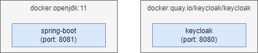
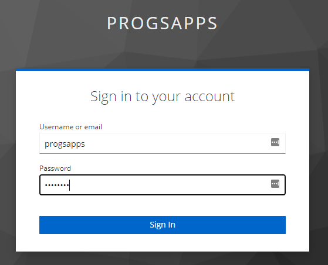
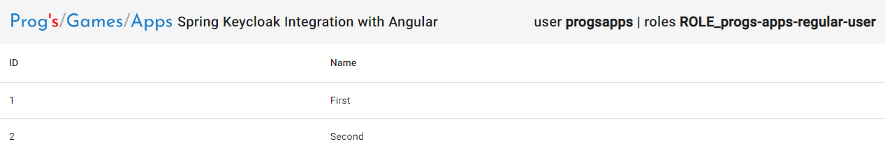
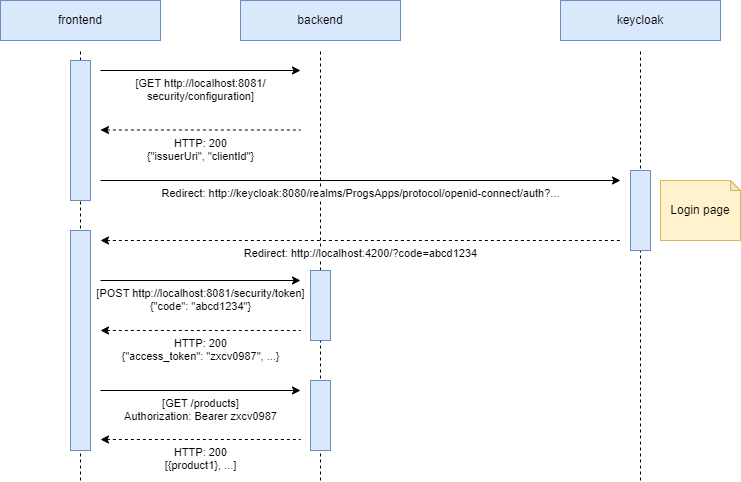

# Prog's Apps - Spring Keycloak Integration with Angular

This is an example how to integrate Keycloak with Spring Boot application. 
> **Note**: Requirement is to retrieve the token via backend application instead of directly calling getting it by the Angular frontend.

## Overview


## Start guide
1. Build using maven:
```
mvn clean install
```
2. Build docker images
```
docker-compose build
```
3. Run containers (`-d` for detached):
```
docker-compose up -d
```
4. Open application under: http://localhost:8081
5. When sign-in page shows up enter (username: *progsapps*, password: *password*)

   
6. Page shows up

   

## Communication diagram
1. Get the configuration of Keycloak from the backend 
2. Redirect to the authentication page of Keycloak
3. Get the token via the backend
4. Get data using access token


## Summary
**A /** Use `spring-boot-starter-security` and `spring-boot-starter-oauth2-resource-server` libraries to integrate Keycloak. Add dependencies in `pom.xml`:
```xml
<dependencies>
  <dependency>
      <groupId>org.springframework.boot</groupId>
      <artifactId>spring-boot-starter-web</artifactId>
      <version>${spring.boot.version}</version>
  </dependency>
  <dependency>
      <groupId>org.springframework.boot</groupId>
      <artifactId>spring-boot-starter-security</artifactId>
      <version>${spring.boot.version}</version>
  </dependency>
  <dependency>
      <groupId>org.springframework.boot</groupId>
      <artifactId>spring-boot-starter-oauth2-resource-server</artifactId>
      <version>${spring.boot.version}</version>
  </dependency>
</dependencies>
```

**B /** Add new properties to `application.properties`:
1. Keycloak client ID:
```
spring.security.oauth2.client.registration.keycloak.client-id=progs-apps-client
```
2. Scope:
```
spring.security.oauth2.client.registration.keycloak.scope=openid
```
3. Issuer uri:
```
spring.security.oauth2.resourceserver.jwt.issuer-uri=http://keycloak:8080/realms/ProgsApps
```


**C /** Configuration of security `com.progsapps.springkeycloakintegration.WebSecurityConfig.filterChain`:
```java
@Bean
public SecurityFilterChain filterChain(HttpSecurity http) throws Exception {
  http.cors().and()
     .authorizeRequests()
     .antMatchers("/product*", "/security/current*")
     .hasRole("progs-apps-regular-user")
     .anyRequest()
     .permitAll();
  http.oauth2ResourceServer(OAuth2ResourceServerConfigurer::jwt);
  return http.csrf().disable().build();
}
```
> **Note**: Spring requires roles to be prefixed with `ROLE_`. Here we configure role without a prefix. 

**D /**
To map roles from JWT Token to spring security roles `JwtRolesConverter` has been implemented and integrated with `JwtAuthenticationConverter`:
```java
@Bean
public JwtAuthenticationConverter jwtAuthenticationConverter(JwtRolesConverter jwtRolesConverter) {
  JwtAuthenticationConverter jwtAuthenticationConverter = new JwtAuthenticationConverter();
  jwtAuthenticationConverter.setJwtGrantedAuthoritiesConverter(jwtRolesConverter);
  return jwtAuthenticationConverter;
}
```